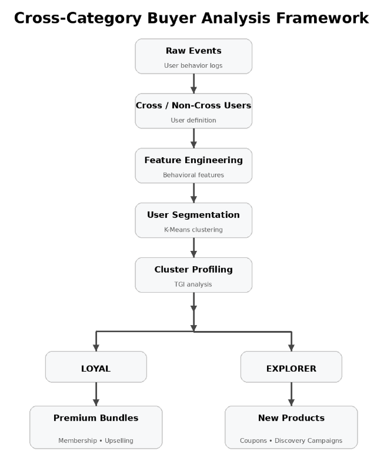
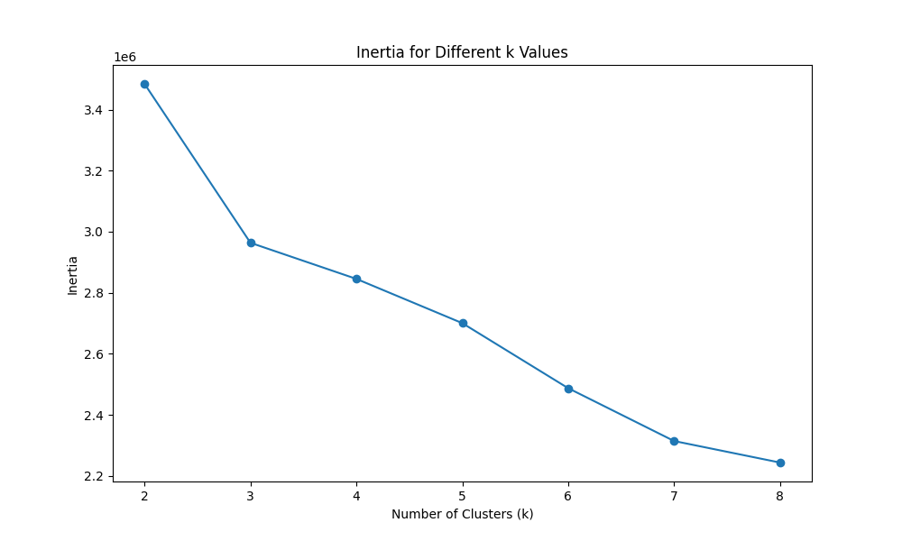
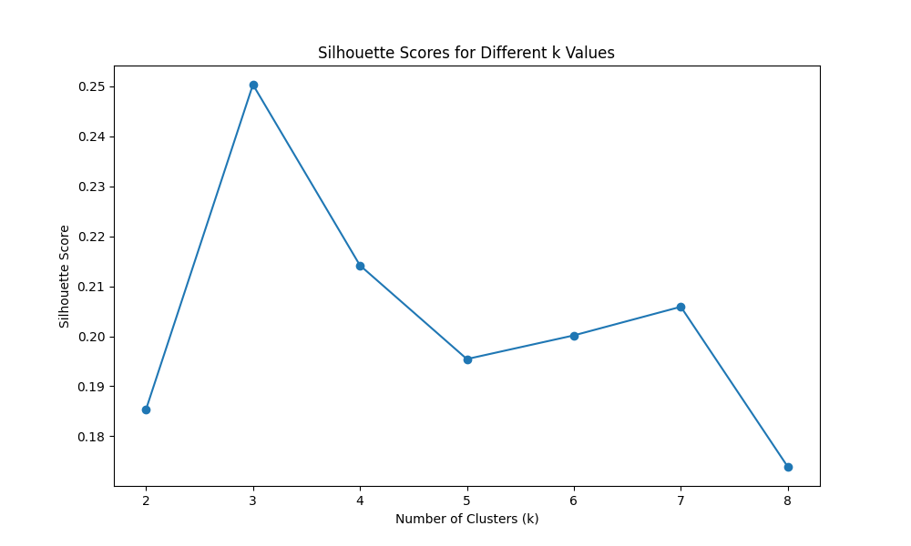
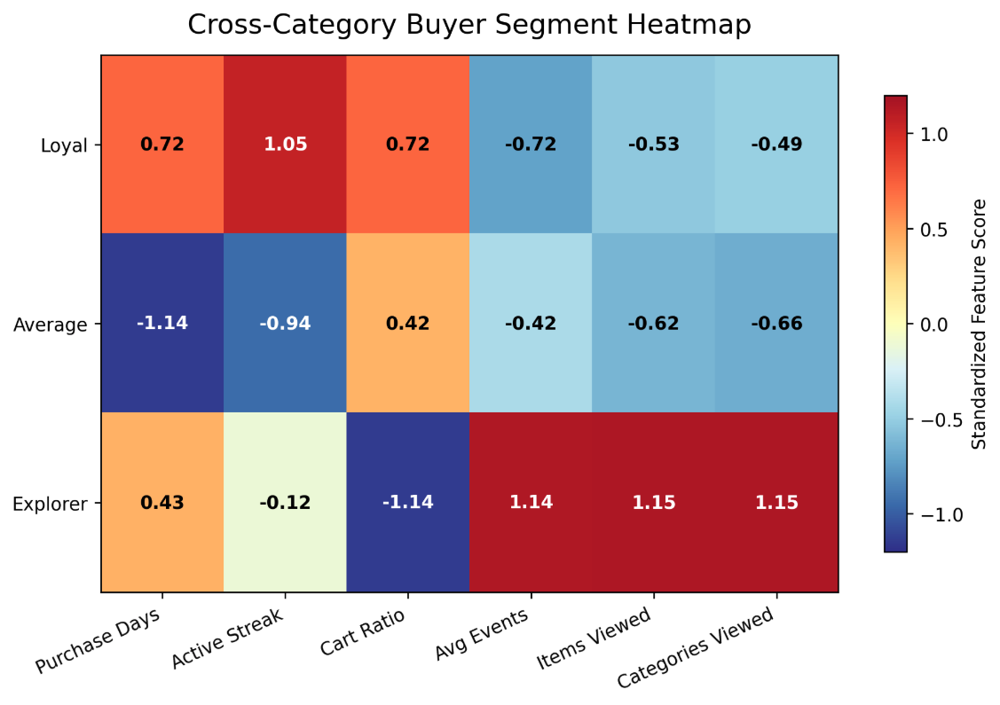
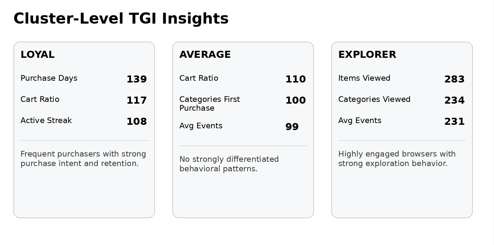
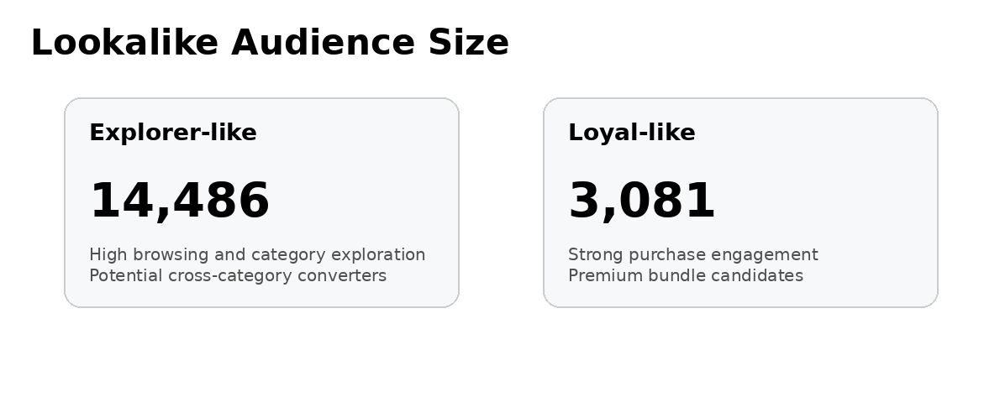

# Customer Segmentation & Lookalike Audience Strategy

A user growth analytics case study using public ecommerce behavioral data.

📄 Full Report:
[View PDF Report](./report/customer_segmentation_report_eng.pdf)

## Business Problem

How can businesses identify customers with higher cross-category purchase potential and design targeted activation strategies to increase customer lifetime value (CLTV) and category penetration?

## Methodology
This project demonstrates an end-to-end customer growth analytics workflow:

- Defined cross-category and non-cross-category buyers
- Engineered 10 behavioral features across five dimensions (recency, frequency, etc.)
- Applied **K-Means** clustering to identify customer segments
- Computed TGI (Target Group Index) for each segment to evaluate behavioral differences versus the overall population and determine **whether segment-specific marketing strategies were warranted**
- Designed segment-specific activation strategies
- Expanded high-potential audiences through lookalike targeting

## K-Means Evaluation
K-Means clustering was evaluated using both the Elbow Method and Silhouette Score. Based on clustering performance and interpretability, K = 3 was selected as the optimal number of customer segments.

## Customer Segmentation

Three distinct customer segments were identified:
- **Loyal**: Frequent purchasers with strong retention and purchase intent
- **Average**: Users with no strongly differentiated behavioral characteristics
- **Explorer**: Highly engaged browsers with strong category exploration behavior

## Customer Profiling
TGI analysis revealed significant behavioral differences across 2 out of 3 segments compared to the overall customer base, enabling more targeted customer activation strategies for loyal-like and explorer-like users.

## Lookalike Audience Expansion
The identified Loyal and Explorer segments were used as seed audiences to find behaviorally similar users among non-cross-category buyers, **creating a scalable target pool** for future segment-specific marketing campaigns.

### Results

## Tech Stack
BigQuery • SQL • Python • K-Means Clustering

---

**Author**: Iris Xia

**Email**: iris.daxia@gmail.com